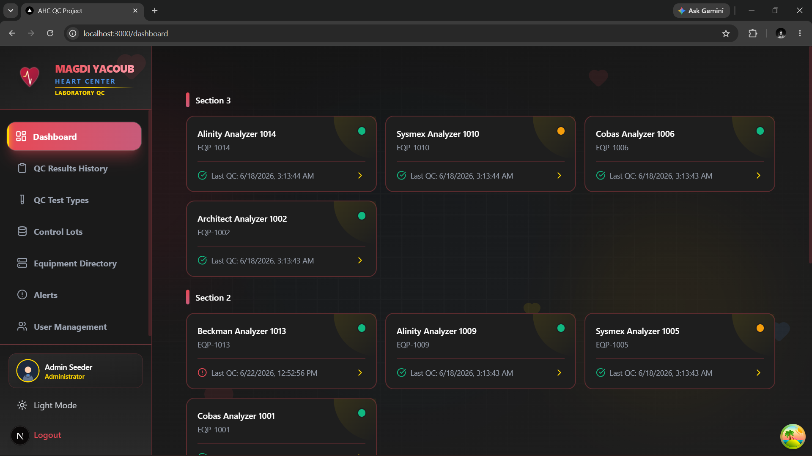
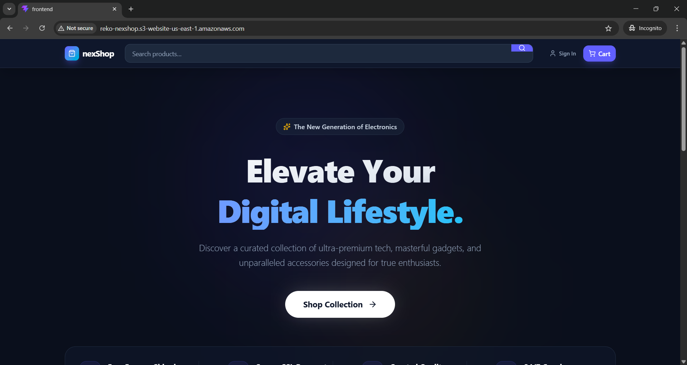
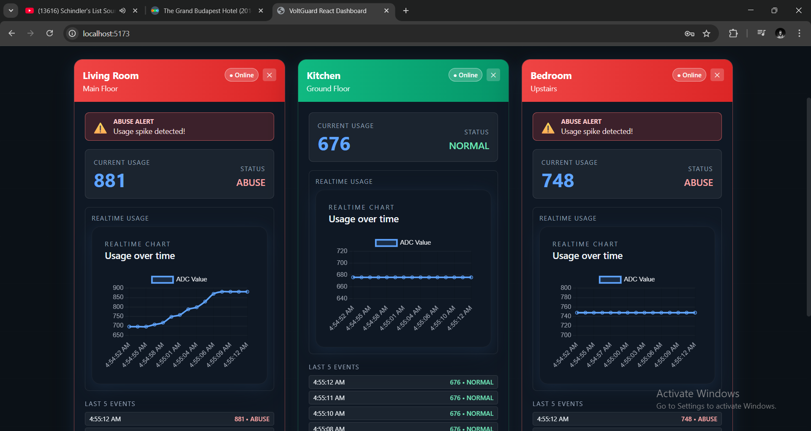

  

<h1 align="center">Patrick Shehata</h1>

Backend Engineer &nbsp;•&nbsp; Distributed Systems Enthusiast &nbsp;•&nbsp; Building Production-Ready Software

---

## 👨‍💻 About Me

I'm Patrick Shehata, a Computer Science graduate from the **Arab Academy for Science, Technology & Maritime Transport (AASTMT)**, where I graduated **3rd in my class** with a **GPA of 3.58**.

I'm passionate about backend engineering and enjoy building reliable, scalable software systems. I enjoy solving complex engineering problems and understanding how systems work under the hood.

I'm currently studying and building projects around:

- Distributed Systems
- Software Architecture
- System Design
- Design Patterns
- Cloud-Native Applications

---

## 🎯 Current Mission

- 📚 Master Distributed Systems
- 🏗️ Build production-grade backend applications
- 🌍 Contribute to open-source projects
- 🚀 Grow into a Software Engineer focused on scalable systems

---

# 🛠 Tech Stack

### Languages

### Backend

### Database & ORM

&nbsp;

### Cloud & DevOps

### Tools

---

# 🚀 Featured Projects

## 🏥 Laboratory Quality Management System

Backend platform developed for the **Magdi Yacoub Heart Foundation** to centralize laboratory quality control data, preserve historical records, provide real-time laboratory monitoring, and streamline quality assurance workflows.

### Highlights

- OTP Authentication
- JWT + Refresh Tokens
- Redis Caching
- Server-Sent Events (SSE)
- Backend-for-Frontend (BFF)
- Swagger Documentation
- Role-based Authorization
- Dockerized Deployment

**Tech Stack**

Next.js • NestJS • PostgreSQL • Drizzle ORM • Redis • Docker

---

## ☁️ Cloud-Native E-Commerce Platform

Cloud-native e-commerce application deployed on AWS featuring AI-powered semantic product search using vector embeddings.

### Highlights

- Dockerized Services
- Semantic Product Search
- pgvector
- AWS Deployment
- REST APIs
- Authentication

**Tech Stack**

Node.js • PostgreSQL • Docker • AWS ECS • AWS EC2 • AWS ECR • Amazon RDS • pgvector

---

## ⚡ VoltGuard — Smart Energy Monitoring System

IoT platform combining embedded systems with a modern web dashboard to monitor household electrical consumption in real time.

### Highlights

- AVR Programming
- UART Communication
- Proteus Simulation
- Socket.IO
- Live Dashboard
- Device Analytics
- Real-Time Monitoring

**Tech Stack**

C • AVR • Node.js • React • Socket.IO • TypeScript

---

## 🎮 Invasion Rush

A Modern OpenGL shooting game featuring custom rendering, collision detection, enemy AI, particle effects, animations, and gameplay mechanics.

**Tech Stack**

C++ • OpenGL • GLUT

---

# 📈 GitHub Statistics

&nbsp;&nbsp;

---

# 🔥 Contribution Streak

---

# 📊 Activity Graph

---

# 📫 Connect

<a href="https://www.linkedin.com/in/YOUR-LINKEDIN">LinkedIn</a>
&nbsp;&nbsp;•&nbsp;&nbsp;
<a href="mailto:YOUR_EMAIL">Email</a>

