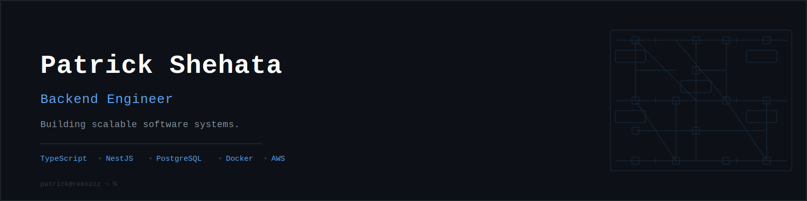

  

  

<h1 align="center">Patrick Shehata</h1>

Backend Engineer • Distributed Systems Enthusiast • Building Production-Ready Software

---

## 👨‍💻 About Me

I'm Patrick Shehata, a Computer Science graduate from the **Arab Academy for Science, Technology & Maritime Transport (AASTMT)**, where I graduated **3rd in my class** with a **GPA of 3.58**.

I'm passionate about backend engineering and enjoy building reliable, scalable software systems. I enjoy solving complex engineering problems and understanding how systems work under the hood.

I'm currently studying and building projects around:

- Distributed Systems
- Software Architecture
- System Design
- Design Patterns
- Cloud-Native Applications

---

# 🛠️ Tech Stack

---

# 🚀 Featured Projects

## 🏥 Laboratory Quality Management System

Backend platform developed for the **Magdi Yacoub Heart Foundation** to centralize laboratory quality control data, preserve historical records, provide real-time laboratory monitoring, and streamline quality assurance workflows.

**Highlights**

- Secure authentication with OTP verification
- Refresh Token Authentication
- Redis caching
- Server-Sent Events (SSE)
- BFF Pattern
- Swagger API Documentation
- PostgreSQL + Drizzle ORM
- Dockerized deployment

---

## ☁️ Cloud-Native E-Commerce Platform

A cloud-native e-commerce platform deployed on AWS featuring semantic product search powered by AI embeddings.

**Highlights**

- Docker
- Amazon ECS
- Amazon ECR
- Amazon EC2
- Amazon RDS
- pgvector
- AI Semantic Search
- PostgreSQL

---

## ⚡ VoltGuard — IoT Smart Energy Monitoring System

An IoT monitoring platform that integrates AVR microcontrollers, UART communication, Node.js, Socket.IO, and React to monitor household electrical consumption in real time.

**Highlights**

- AVR Programming
- Proteus Simulation
- UART Communication
- Node.js Backend
- Socket.IO
- React Dashboard
- Live Analytics
- Real-Time Monitoring

---

## 🎮 Invasion Rush

A Modern OpenGL shooting game featuring custom rendering, collision detection, enemy AI, animation, particle effects, and gameplay mechanics.

---

# 📈 GitHub Statistics

---

# 🔥 Contribution Streak

---

# 📊 Activity Graph

---

# 📫 Connect

<a href="YOUR_LINKEDIN">
LinkedIn
</a>
&nbsp;&nbsp;•&nbsp;&nbsp;

<a href="mailto:YOUR_EMAIL">
Email
</a>

